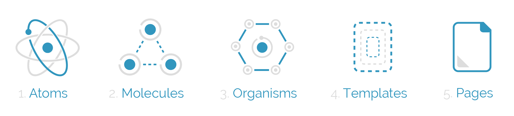
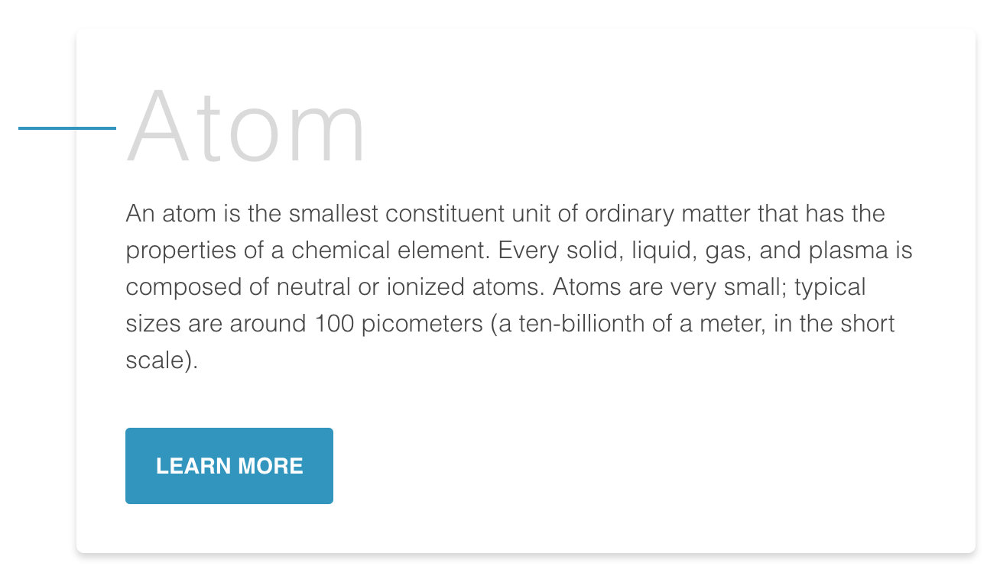
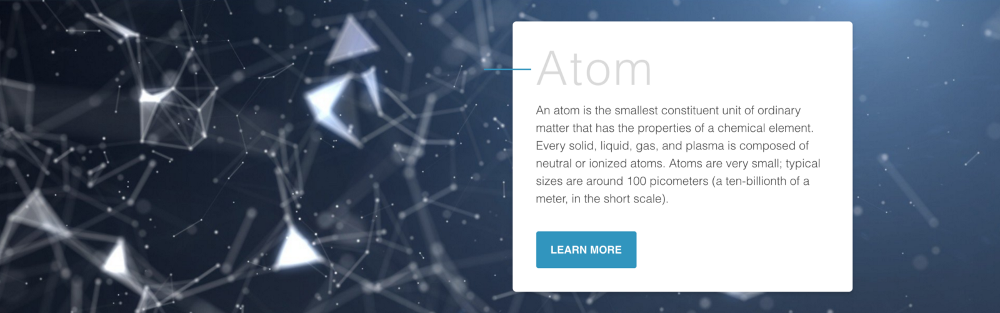
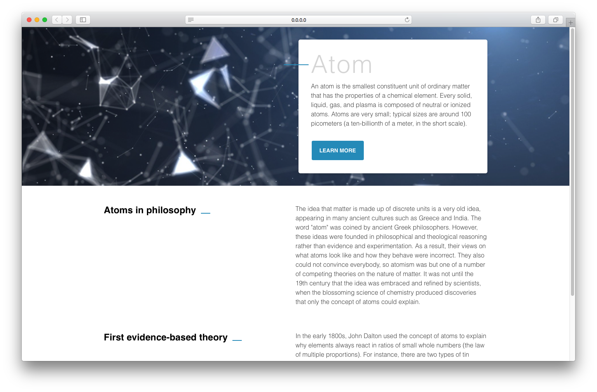

# Folder structure (Atomic Design)



## What is Atomic Design?

Popularly known within the design world, Atomic Design helps to build consistent, solid and reusable design systems. Plus, in the world of React, Vue and frameworks that stimulate the componentization, Atomic Design is used unconsciously; but when used in the right way, it becomes a powerful ally for developers. The name Atomic Design comes from the idea of separating the components in atoms, molecules, organisms, templates and pages, like in the image above. But what are the responsibilities of each separated part?

## Atoms


Atoms are the smallest possible components, such as buttons, titles, inputs or event color pallets, animations, and fonts. They can be applied on any context, globally or within other components and templates, besides having many states, such as this example of button: disabled, hover, different sizes, etc.

## Molecules



They are the composition of one or more components of atoms. Here we begin to compose complex components and reuse some of those components. Molecules can have their own properties and create functionalities by using atoms, which don’t have any function or action by themselves.

## Organisms



Organisms are the combination of molecules that work together or even with atoms that compose more elaborate interfaces. At this level, the components begin to have the final shape, but they are still ensured to be independent, portable and reusable enough to be reusable in any content.

## Templates


In this state we stop composing components and begin to set their context. Moreover, the templates create relationships between the organisms and others components through positions, placements and patterns of the pages but it doesn’t have any style, color or component rendered. That’s why it looks like a wireframe.

## Pages



Pages are the navigate parts of the application and it’s where the components are distributed in one specific template. The components get real content and they’re connected with the whole application. At this stage, we can test the efficiency of the design system to analyse if all the components are independent enough or if we need to split them in smaller parts.

## React + Atomic Design

When we started to use Atomic Design within React we had to adjust some rules of the methodology to ensure that components were reused as much as possible, that they were stateless, without styles of positions and very specific margins so to avoid any side effects in the pages of application.

So with each new component we asked ourselves: “Are these components generic enough to avoid specificity and/or repeated code in whatever context they are used?”

So we were able to write a few rules:

1. The Atomic Design should have a file of **variables** and it must be imported by each component;
1. The **atoms** should be written without margins and positions;
1. Only the **molecules** and **organisms** can set the positions of atoms, but these stacks can’t have any styles of margins and positions;
1. **Templates** have only one function: to set the grid of pages but never positions of specific components;
1. **Pages** render the components with a template defined and it’s here that the **Atomic Design** will be connected to the rest of the application;

## Structure

```bash
src
├── components
    └── ui
        ├── atoms
        │   └── Card
        │       └── Card.tsx
        ├── molecules
        │   └── UserCard
        │       └── UserCard.tsx
        ├── organisms
        │   └── UserCardSection
        │       └── UserCardSection.tsx
        └── templates
            └── Default
                └── Default.tsx
```
